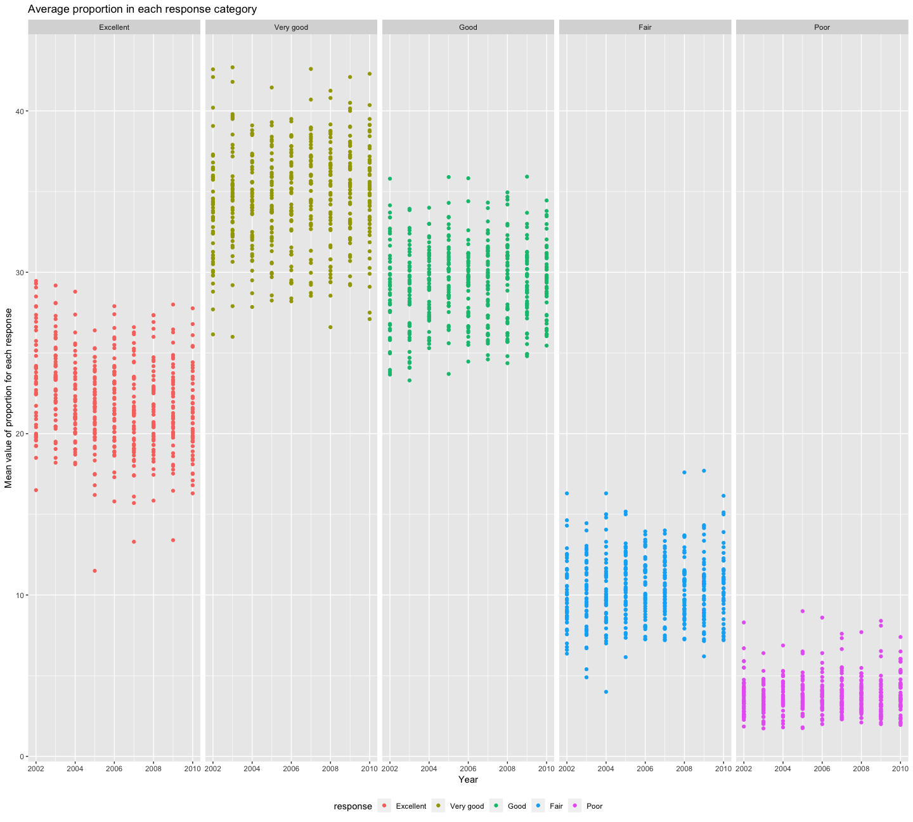
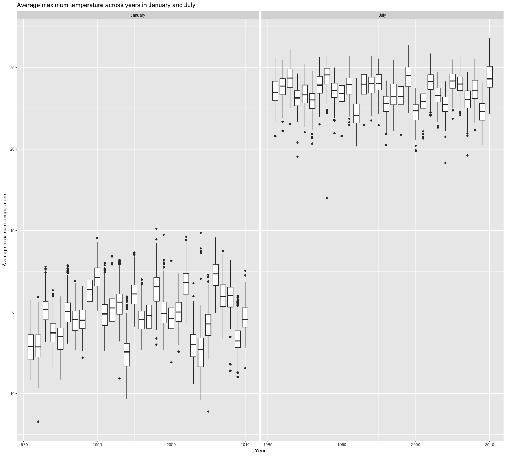

p8105\_hw3\_sy2824
================
Sijia Yue
2018-10-06

Question 1
==========

Cleaning data
-------------

-   Format the data to use appropriate variable names `clean_names()`
-   Filter with “Overall Health” topic
-   Include only responses from “Excellent” to “Poor”
-   Organize responses as a factor taking levels ordered from “Excellent” to “Poor”

``` r
tidy_brfss = brfss_smart2010 %>% 
  janitor::clean_names() %>% 
  filter(topic == "Overall Health") %>% 
  select(-class, -topic, -question, -sample_size, -(confidence_limit_low:geo_location))  %>% 
  mutate(response = forcats::fct_relevel(response,c("Excellent", "Very good", "Good", "Fair", "Poor")))
```

Questions
---------

**In 2002, which states were observed at 7 locations?**

``` r
filter(tidy_brfss, year == "2002") %>% 
  group_by(locationabbr) %>% 
  summarize(n_location = n_distinct(locationdesc)) %>% 
  filter(n_location == "7") 
```

    ## # A tibble: 3 x 2
    ##   locationabbr n_location
    ##   <chr>             <int>
    ## 1 CT                    7
    ## 2 FL                    7
    ## 3 NC                    7

In 2002, the states that were observed at 7 locations are `CT`, `FL` and `NC`.

**Make a “spaghetti plot” that shows the number of observations in each state from 2002 to 2010.**

``` r
 observation_in_state = tidy_brfss %>% 
  group_by(locationabbr,year) %>% 
  summarize(n_location = n_distinct(locationdesc)) 

  ggplot(observation_in_state, aes(y = n_location, x = year)) +
  geom_line(aes(color = locationabbr), alpha = .5) +
  labs(
    title = "Spaghetti plot",
    x = "Year",
    y = "Number of observations in each state"
  )
```


``` r
observation_in_state %>% 
  arrange(desc(n_location))
```

    ## # A tibble: 443 x 3
    ## # Groups:   locationabbr [51]
    ##    locationabbr  year n_location
    ##    <chr>        <int>      <int>
    ##  1 FL            2007         44
    ##  2 FL            2010         41
    ##  3 NJ            2005         19
    ##  4 NJ            2006         19
    ##  5 NJ            2009         19
    ##  6 NJ            2010         19
    ##  7 NJ            2008         18
    ##  8 NC            2008         16
    ##  9 NJ            2007         16
    ## 10 TX            2010         16
    ## # ... with 433 more rows

The scatter plot shows the numbers of observations in each state orm 2002 to 2010. From the plot, the observation numbers of most of the states are stable from these 8 years in the range of 0 to 15. However, for the state `FL`, `NJ` and `NC`, the number shows a vast change in the year of 2006, 2008 and 2010.

**Make a table showing, for the years 2002, 2006, and 2010, the mean and standard deviation of the proportion of “Excellent” responses across locations in NY State.**

``` r
filter(tidy_brfss, year == "2002" | year == "2006" | year == "2010") %>% 
  filter(locationabbr == "NY") %>% 
  filter(response == "Excellent") %>% 
  spread(key = response, value = data_value) %>% 
  janitor::clean_names() %>% 
  group_by(year) %>% 
  summarize(
    mean_proportion = mean(excellent),
    sd_proportion = sd(excellent)
    ) 
```

    ## # A tibble: 3 x 3
    ##    year mean_proportion sd_proportion
    ##   <int>           <dbl>         <dbl>
    ## 1  2002            24.0          4.49
    ## 2  2006            22.5          4.00
    ## 3  2010            22.7          3.57

In year 2002, it has the biggest mean proportion and the largest standard deviation of proportion as well. And reversely, in year 2010, it have the least mean proportion and the smallest standard deviation of proportion. For year 2006, it stays in the middle of the dataset.

**For each year and state, compute the average proportion in each response category (taking the average across locations in a state). Make a five-panel plot that shows, for each response category separately, the distribution of these state-level averages over time.**

``` r
  group_by(tidy_brfss, year, locationabbr,response) %>% 
  summarize(mean = mean(data_value, na.rm = TRUE)) %>% 
  
  ggplot(aes(x = year, y = mean, color = response)) +
  geom_point() +
  facet_grid(.~response) +
    labs(
      title = "Average proportion in each response category",
      x = "Year",
      y = "Mean value of proportion for each response"
    ) +
  theme(legend.position = "bottom")
```

 From the plot, there's a tendency to show that the mean value of each response stays almost the same over year. Also, the response of `Very good` and `Good` weigh the most in mean value of proportion. `Poor` and `Fair` share the least proportion in mean value of proportion.

Question 2
==========

Description of dataset
----------------------

``` r
cart_data = instacart
```

This is a dataset that stores the information of orders and the relaventing information of a the odered products. There are 1384617 rows and 15 coloums.The dataset has two knids of information: order information and product information. For order information, it contains about the order id, order number, customer id,etc. For product information, it contains information about product name, product id, department, etc.

Also, each order id could coutain more than one product id, so the key varibale of this dataset should be `product id` and its relevant information including `product name`, `aisle id`, `department id`, `department name`, `aisele name`.

To give an example of an observation, take `oder id` 1 to illustrate. In total, there are 8 items in order id 1, and the product names are Bulgarian Yogurt and the other 7 items. For Bulgarian Yogurt, it has an unique product id and belongs to a aisle and a department. For each aisle and department, it also has the unique id separately.

**How many aisles are there, and which aisles are the most items ordered from?**

``` r
distinct(cart_data, aisle_id) %>% 
  count()
```

    ## # A tibble: 1 x 1
    ##       n
    ##   <int>
    ## 1   134

``` r
cart_data %>% 
  group_by(aisle) %>% 
  summarize(number = n()) %>% 
  arrange(desc(number))
```

    ## # A tibble: 134 x 2
    ##    aisle                         number
    ##    <chr>                          <int>
    ##  1 fresh vegetables              150609
    ##  2 fresh fruits                  150473
    ##  3 packaged vegetables fruits     78493
    ##  4 yogurt                         55240
    ##  5 packaged cheese                41699
    ##  6 water seltzer sparkling water  36617
    ##  7 milk                           32644
    ##  8 chips pretzels                 31269
    ##  9 soy lactosefree                26240
    ## 10 bread                          23635
    ## # ... with 124 more rows

There are 134 aisles. The most items ordered from is `fresh vegetables` and the second popular order item is `fresh fruits`.

**Make a plot that shows the number of items ordered in each aisle. Order aisles sensibly, and organize your plot so others can read it.**

``` r
cart_data %>% 
  group_by(aisle) %>% 
  summarize(number = n()) %>% 
  mutate(aisle = fct_reorder(aisle, desc(number))) %>% 
  ggplot(aes(x = aisle, y = number)) +
  geom_point() +
  labs(
      title = "Number of items ordered in each aisle",
      x = "Items",
      y = "Number of items"
    ) +
  scale_y_log10(breaks = c(200000,20000, 2000, 200), 
                     labels = c("200000","20000", "2000", "200"),
                     limits = c(200, 200000)) +
  theme(legend.position = "bottom",
      axis.text.x = element_text(angle = 90, hjust = 1, size = rel(1)))
```

 The plot shows the number of items ordered in each aisle in descending order to be readable for human. Also, the `scale_y_log10` is used to scale the y axis in order to distinguish the very small difference in a large range of data.

**Make a table showing the most popular item aisles “baking ingredients”, “dog food care”, and “packaged vegetables fruits”.**

``` r
popular_items = filter(cart_data, aisle %in% c('baking ingredients', 'dog food care', 'packaged vegetables fruits')) %>% 
group_by(aisle, product_name) %>% 
  summarize(number = n()) 

 top_baking_ingredients = filter(popular_items, aisle == "baking ingredients") %>% 
  arrange(desc(number)) %>%
    head(3) 
 
  top_dog_food_care = filter(popular_items, aisle == "dog food care") %>% 
    arrange(desc(number)) %>% 
    head(3)
  
  top_packaged_vegetables_fruits = filter(popular_items, aisle == "packaged vegetables fruits") %>% 
    arrange(desc(number)) %>% 
    head(3)
  
 popular_items = bind_rows(top_baking_ingredients,top_dog_food_care,top_packaged_vegetables_fruits)  
   popular_items
```

    ## # A tibble: 9 x 3
    ## # Groups:   aisle [3]
    ##   aisle                    product_name                             number
    ##   <chr>                    <chr>                                     <int>
    ## 1 baking ingredients       Light Brown Sugar                           499
    ## 2 baking ingredients       Pure Baking Soda                            387
    ## 3 baking ingredients       Cane Sugar                                  336
    ## 4 dog food care            Snack Sticks Chicken & Rice Recipe Dog …     30
    ## 5 dog food care            Organix Chicken & Brown Rice Recipe          28
    ## 6 dog food care            Small Dog Biscuits                           26
    ## 7 packaged vegetables fru… Organic Baby Spinach                       9784
    ## 8 packaged vegetables fru… Organic Raspberries                        5546
    ## 9 packaged vegetables fru… Organic Blueberries                        4966

The top 3 popular items in aisle `baking ingredients` are `Light Brown Sugar`, `Pure Baking Soda` and `Cane Sugar`. The top 3 popular items in aisle `dog food care` are `Snack Sticks Chicken & Rice Recipe Dog Treat`, `Organix Chicken & Brown Rice Recipe` and `Small Dog Biscuits`. The top 3 popular items in aisle `packaged vegetables fruits` are `Organic Baby Spinach`, `Organic Raspberries` and `Organic Blueberries`.

**Make a table showing the mean hour of the day at which Pink Lady Apples and Coffee Ice Cream are ordered on each day of the week; format this table for human readers (i.e. produce a 2 x 7 table)**

``` r
mutate(cart_data, order_dow = factor(order_dow, labels  = c("Sunday", "Monday", "Tuesday", "Wednesday", "Thursday", "Friday", "Saturday"))) %>% 
filter(product_name %in% c("Pink Lady Apples","Coffee Ice Cream")) %>% 
  group_by(product_name, order_dow) %>%
  summarize(mean_hour = mean(order_hour_of_day)) %>% 
  spread(key = order_dow, value = mean_hour)
```

    ## # A tibble: 2 x 8
    ## # Groups:   product_name [2]
    ##   product_name     Sunday Monday Tuesday Wednesday Thursday Friday Saturday
    ##   <chr>             <dbl>  <dbl>   <dbl>     <dbl>    <dbl>  <dbl>    <dbl>
    ## 1 Coffee Ice Cream   13.8   14.3    15.4      15.3     15.2   12.3     13.8
    ## 2 Pink Lady Apples   13.4   11.4    11.7      14.2     11.6   12.8     11.9

For `Coffee Ice Cream`, people are tend to oeder it around 13-15 pm. For `Pink Lady Apples`, customers are more likely to make purchase arount 11am. to 14pm.

Question 3
==========

Description of dataset
----------------------

``` r
ny_noaa 
```

    ## # A tibble: 2,595,176 x 7
    ##    id          date        prcp  snow  snwd tmax  tmin 
    ##    <chr>       <date>     <int> <int> <int> <chr> <chr>
    ##  1 US1NYAB0001 2007-11-01    NA    NA    NA <NA>  <NA> 
    ##  2 US1NYAB0001 2007-11-02    NA    NA    NA <NA>  <NA> 
    ##  3 US1NYAB0001 2007-11-03    NA    NA    NA <NA>  <NA> 
    ##  4 US1NYAB0001 2007-11-04    NA    NA    NA <NA>  <NA> 
    ##  5 US1NYAB0001 2007-11-05    NA    NA    NA <NA>  <NA> 
    ##  6 US1NYAB0001 2007-11-06    NA    NA    NA <NA>  <NA> 
    ##  7 US1NYAB0001 2007-11-07    NA    NA    NA <NA>  <NA> 
    ##  8 US1NYAB0001 2007-11-08    NA    NA    NA <NA>  <NA> 
    ##  9 US1NYAB0001 2007-11-09    NA    NA    NA <NA>  <NA> 
    ## 10 US1NYAB0001 2007-11-10    NA    NA    NA <NA>  <NA> 
    ## # ... with 2,595,166 more rows

This dataset stores the information of snow in New York City from year 1981 to 2010. There are 2595176 rows and 7 coloums. The data is stored by `id` as weather station id and `date` as noted date. The information of snow is stored as `prcp`, `snow` and `snwd`. Temperature is denoted as `tmax` for maximum temperature and `tmin` for minimum tempetature.

The key variables of this dataset are `id` and `date`, since it defines which weather station and what date the numbers are recorded.

For missing data, even though we lost some data from different weather station and date, comparing to the large amount of weather station we have, the missing data is not an issue for our study.

**Do some data cleaning. Create separate variables for year, month, and day. Ensure observations for temperature, precipitation, and snowfall are given in reasonable units. For snowfall, what are the most commonly observed values? Why?**

``` r
tidy_ny_noaa = ny_noaa %>% 
  separate( date, into = c("year", "month", "day"), sep = "-") %>% 
  mutate(
    year = as.integer(year),
    month = as.integer(month),
    month = month.name[month],
    day = as.integer(day),
    prcp = prcp/10,
    snow = as.integer(snow),
    snwd = as.integer(snwd),
    tmax = as.numeric(tmax)/10,
    tmin = as.numeric(tmin)/10
    )

filter(tidy_ny_noaa, snow != "NA") %>% 
  group_by(snow) %>% 
  summarize(number = n()) %>% 
  arrange(desc(number)) %>% 
  head(4)
```

    ## # A tibble: 4 x 2
    ##    snow  number
    ##   <int>   <int>
    ## 1     0 2008508
    ## 2    25   31022
    ## 3    13   23095
    ## 4    51   18274

So, `0` is the most commonly ovserved value. Because in most days of a year, New York would not snow.

**Make a two-panel plot showing the average MAX temperature in January and in July in each station across years. Is there any observable / interpretable structure? Any outliers?**

``` r
filtered_ny_noaa = filter(tidy_ny_noaa, month %in% c("January" , "July")) %>% 
group_by(month, year, id) %>% 
  summarize(mean_tmax = mean(tmax, na.rm = TRUE)) %>% 
  filter(mean_tmax != "NaN") 
  
ggplot(filtered_ny_noaa, aes(x = year, y = mean_tmax, group = year)) +
  geom_boxplot() +
  facet_grid(~month) +
  labs(
    x = "Year",
    y = "Average maximum temperature",
    title = "Average maximum temperature across years in January and July"
  )
```

 Obviously, the average maximum tempeture in January is lower than in July. The average maximum tempeture in January is around 0 ºC, while in July is around 27ºC. For outliers, in January, most of the outliers lie above the mean value. In contrast, the outliers in July all lies below the mean temperture.

**Make a two-panel plot showing (i) tmax vs tmin for the full dataset (note that a scatterplot may not be the best option); and (ii) make a plot showing the distribution of snowfall values greater than 0 and less than 100 separately by year.**

``` r
temperature_plot = 
tidy_ny_noaa %>% 
  filter(tmax != "NA", tmin != "NA") %>% 
  ggplot(aes(x = tmin, y = tmax)) +
  geom_density2d() +
  labs(
    x = "Minimum temperature (ºC)",
    y = "Maximum temperature (ºC)",
    title = "Maximum vs Minimum Temperature"
  )

snowfall_plot = 
  tidy_ny_noaa %>% 
  filter(snow > 0 , snow < 100) %>% 
  ggplot(aes(x = year, y = snow)) +
  geom_boxplot(aes(group = year)) +
  labs(
    x = "Year",
    y = "Snowfall (mm)",
    title = "Distribution of snowfall values over years"
  )

temperature_plot + snowfall_plot
```


To show the relationship between `tmax` and `tmin`, scatterplot is not a good choice. Here I uses `geom_density2D` function to plot a 2D density function of `tmax` and `tmin`. The lines show the same value of the two variables. Since, the lines have a tendency to get closer, so `tmax` and `tmin` are coreelated.

To show the distribution of snowfall values greater than 0 and less than 100 separately by year, boxplot would be reasonable to illustrate. From the plot we could find out, for most of the years, the snowfall values are pretty stable. However, in the year of 1998, 2006, and 2010, outliers occurs. Expecially in the year of 2006, the mean value has dropped vastly comparing to other years.
